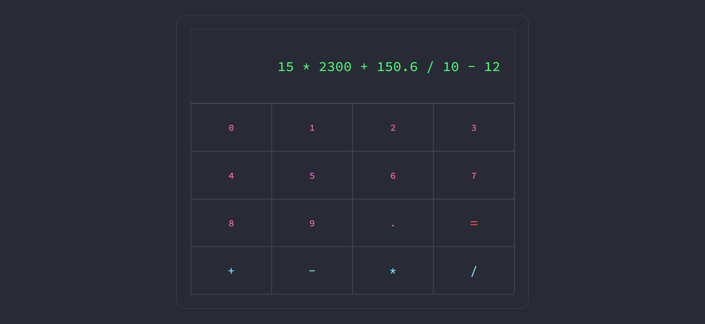
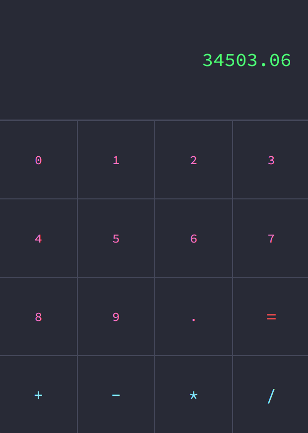

# Calculator-2.0
### Welcome to the Calculator repository

#### Project information:

A calculator made to perform the four basic operations. Design made using the colors of the Dracula theme, popular among developers.

#### How it works?

The application is based on three pillars: state, updateState( ), calculateState( ). All stored within a context that can be accessed globally (by the entire application).

- state: The value stored in this state is the one that will be displayed to the user in the calculation part of the calculator. It is the manipulation of this state that makes it possible for the user to interact with the application, being able to insert values or calculate the inserted values.

- updateState: Used by all button components except equality. Each button when touched can use this function to modify the state, adding its respective value to it.

- calculateState

## Layout:

## Layout Mobile:

## Installation and Execution:
> Make sure you have Node.js and npm (or yarn) installed on your machine.

- Clone this repository to your local environment.
- Navigate to the project directory in the terminal.
- Run the command npm install or yarn install to install the dependencies.

## Technologies:
- HTML
- CSS
- JavaScript
- React